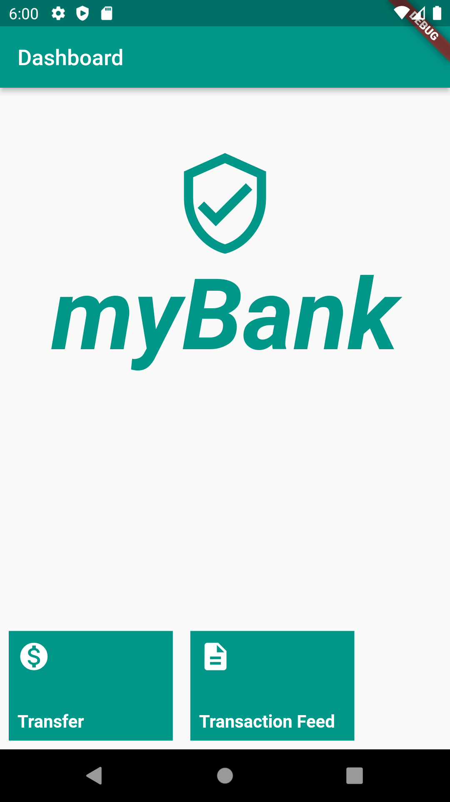
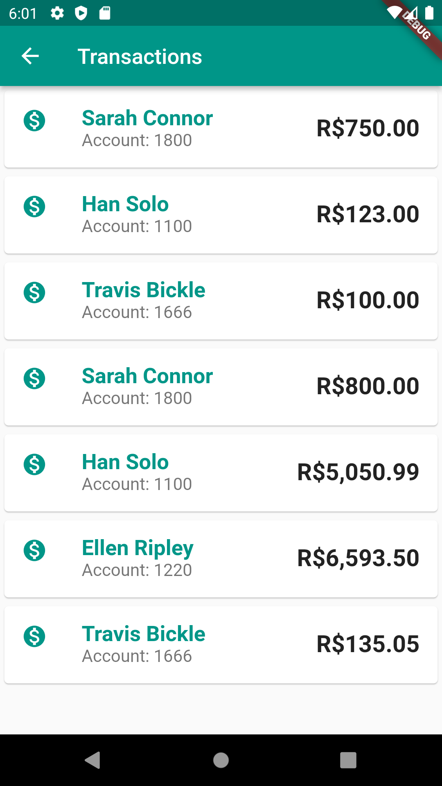
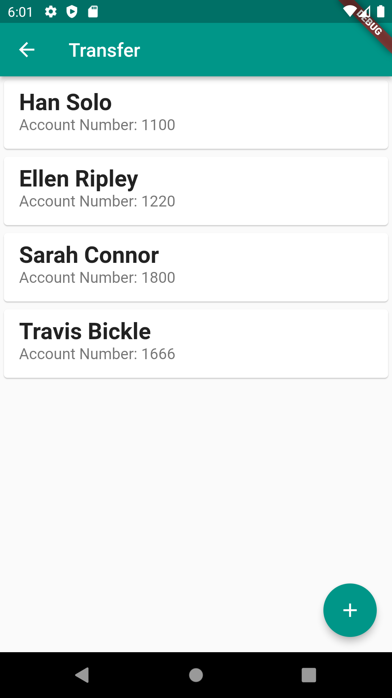
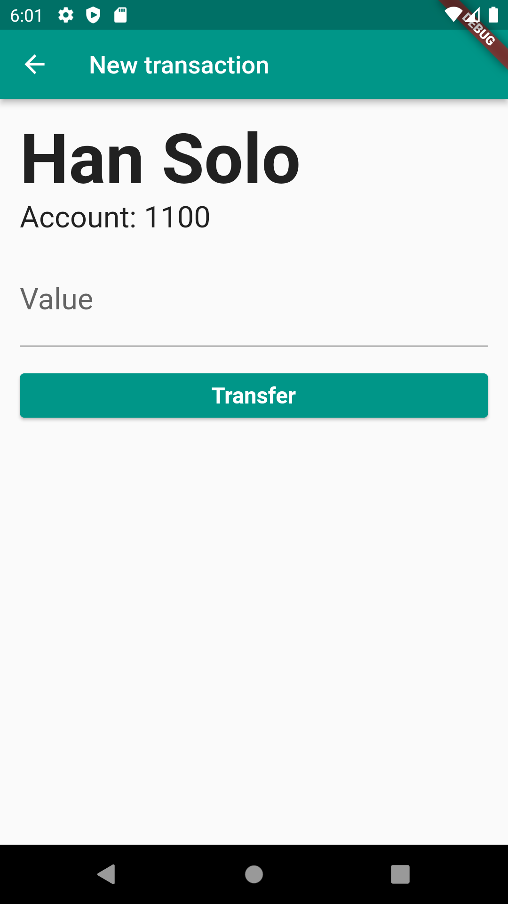
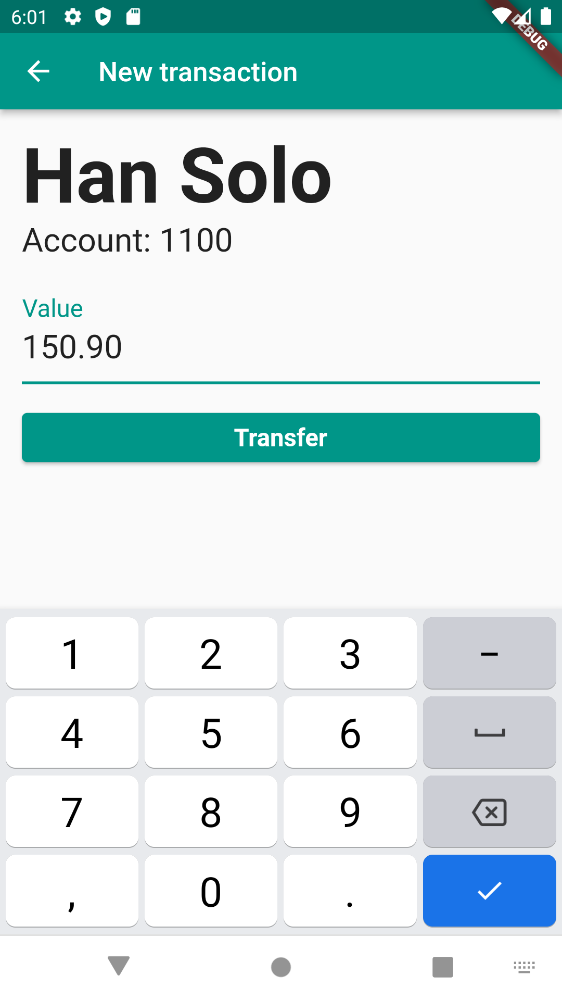
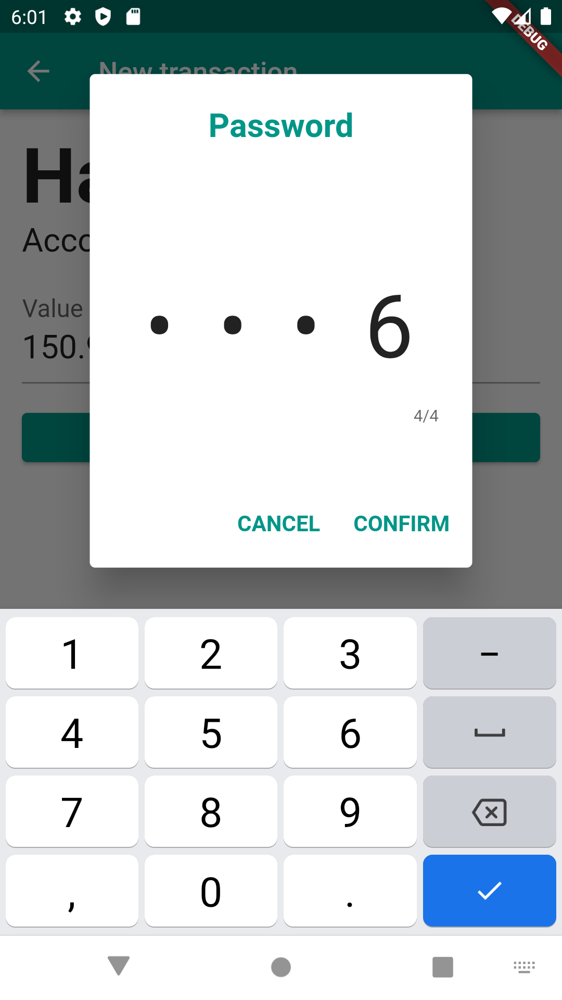
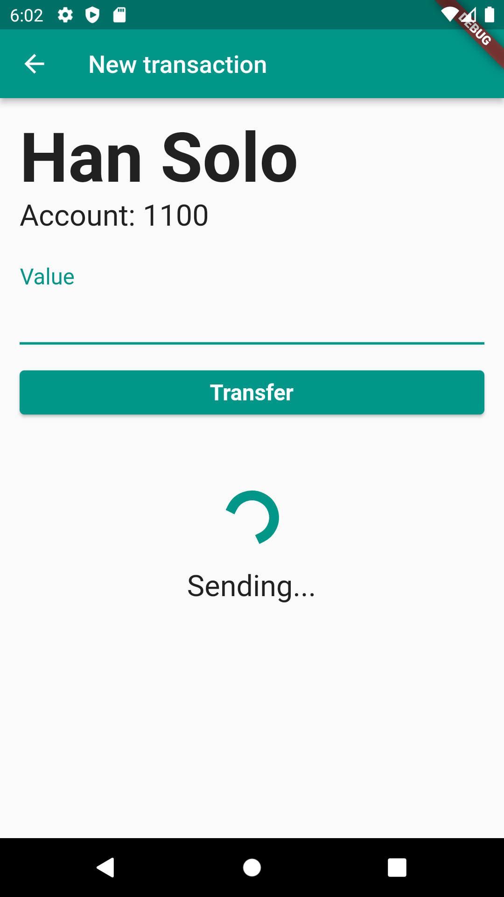
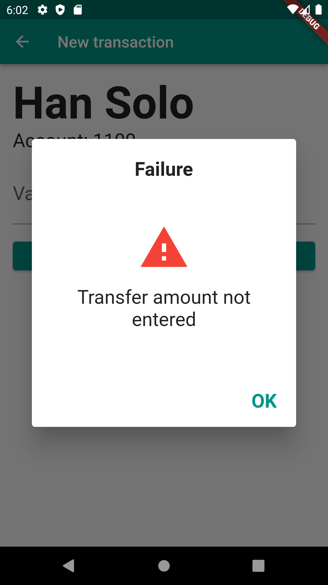
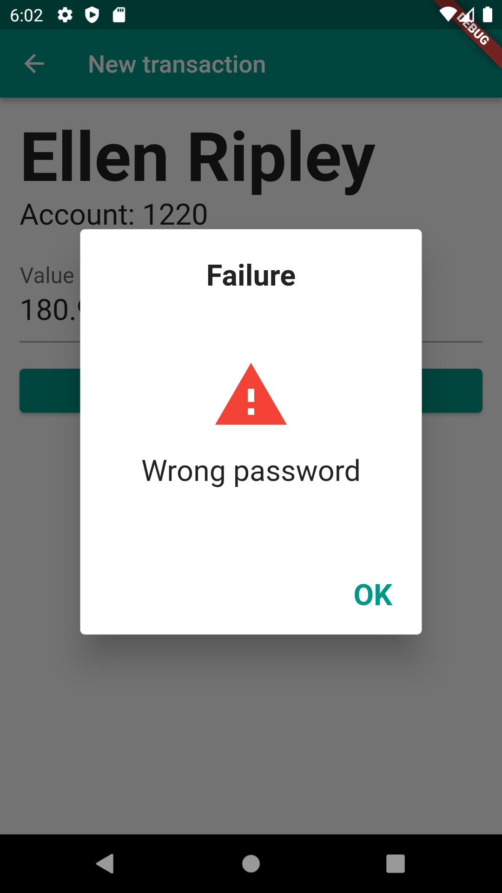
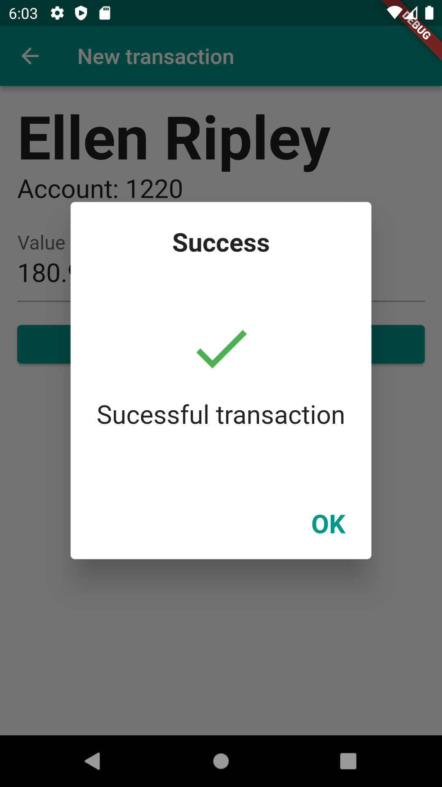

# Comunicação HTTP

> **obs1.:** Para uso do webApi de exemplo, vá a pasta **WebApiStudies** e no arquivo README tem toda a descrição de utilização.
> 
> **obs2.:** Senha padrão para transferências é o valor 1000. 
> 
> **obs3.:** Alterar a url do `webclient.dart` para o seu ip local `const String baseUrl = 'http://<IP DA SUA MAQUINA AQUI>:8080/transactions';`

## Objetivos ao completar os estudos
- Crie e mostre um Dialog
- Capture erros em chamadas do web client
- Apresente adequadamente a mensagem de resposta da requisição
- Configura o App para lidar com diferentes tipos de erros
- Adicione um progresso enquanto a requisição web é realizada

## Ementas:

### Autenticando transferência
- Orientações iniciais e organização do curso
- Preparando o ambiente
- Criando o dialog de autenticação
- Implementando o Dialog
- Para saber mais - Criando dialogs com SimpleDialog
- Integrando dialog de autenticação
- Transferindo com autenticação
- Problemas na autenticação
- Evitando o problema de contexto
- O que aprendi?
    - Implementar um dialog;
    - Evitar o problema de envio de `BuildContext` diferentes.

### Lidando com falhas no envio
- Identificando erros da web api
- Capturando erros com o Future
- Apresentando mensagem de feedback
- Apresentando mensagens de resposta
- Refatorando o código
- Extraindo código
- Para saber mais - SnackBar
- O que aprendi?

### Evitando múltiplos problemas
- Lidando com erros genéricos
- Lidando com diferentes exceptions
- Capturando erros genéricos
- Capturando erros genéricos
- Para saber mais - Respostas de sucesso
- O que aprendi?
    - Capturar exceptions específicas;
    - Capturar múltiplas exceptions;
    - Implementar exceptions personalizadas.

### Idempotência ao enviar transferências
- Problema de multiplas requisições
- Configurando o delay e adicionando o UUID
- Enviando apenas uma transferência
- Evitando transferência duplicada
- Para saber mais - Idempotência e UUID
- O que aprendi?
    - Aplicar idempotência ao enviar transferências;
    - Utilizar UUID no Dart;
    - Evitar problema de código HTTP inesperado.

### Feedback ao enviar transferência
- Adicionando progresso no formulário
- Adicionando o progresso no formulário
- Implementando lógica do progresso
- Apresentando progresso dinamicamente
- Para saber mais - progresso linear
- Conclusão
- Projeto final
- O que aprendi?
    - Implementar feedback de envio ao enviar transferências;
    - Realizar pós execução ao finalizar o Future.

***

## Flutter project screens - myBank App

